# Escape Room
## Description
It's a simple escape room web "game"  
It was made with HTML, CSS and JS  
This is a project made so i could learn some JS, so i took more time than it should and it's sadly poor, plus, it was the first time i committed through git in vscode :)  

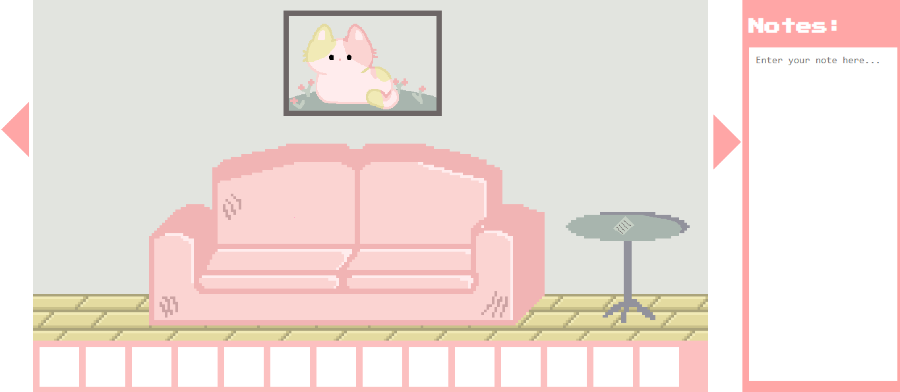

It's basically the wall the player is seeing, two "arrows" (one for each direction, left and right), the inventory bar and a note space, so the player can organize their clues and conclusions, or whatever they want to remember later. 

## Use instructions (guide to escape the room)
Each wall has a clue, each one guiding to a number, in the end, the player will need to combine them, creating the code to escape the room according to a "guide" (paper explaining the order of the digits), that they can find in the room. 
(to make this guide, i chose to move with the right arrow)

### First Wall 

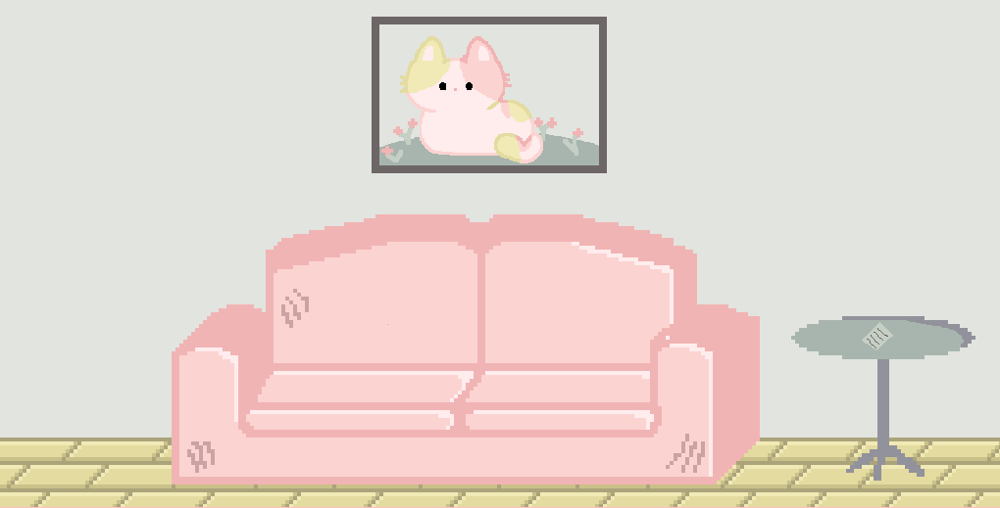

At the first wall, you will see the "guide" on the table

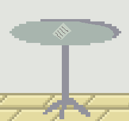

### Second Wall 

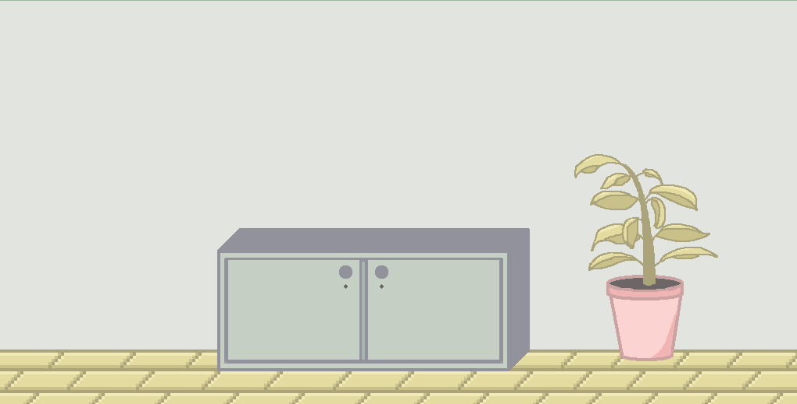

At this wall, you will see a cabinet that will give you access to two clues, but one of them is locked. (The key for the locked one will be at the Third Wall)

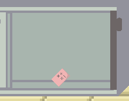  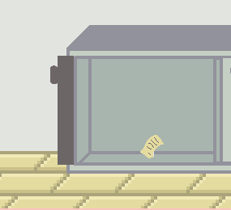

### Third Wall

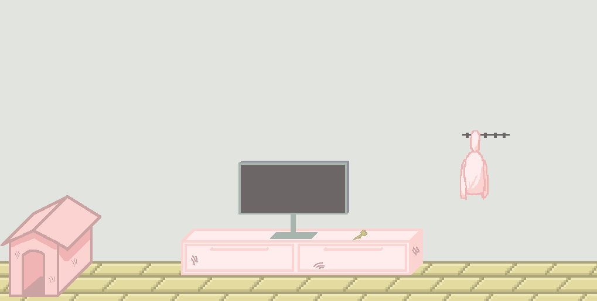

At this one, you will see a TV and next to it, there's a key that unlocks the cabinet of the second wall. 
When clicking on the TV, it will turn on and open a weather channel, that is gonna be another clue.

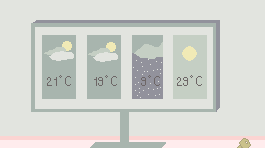  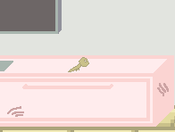

### Fourth Wall

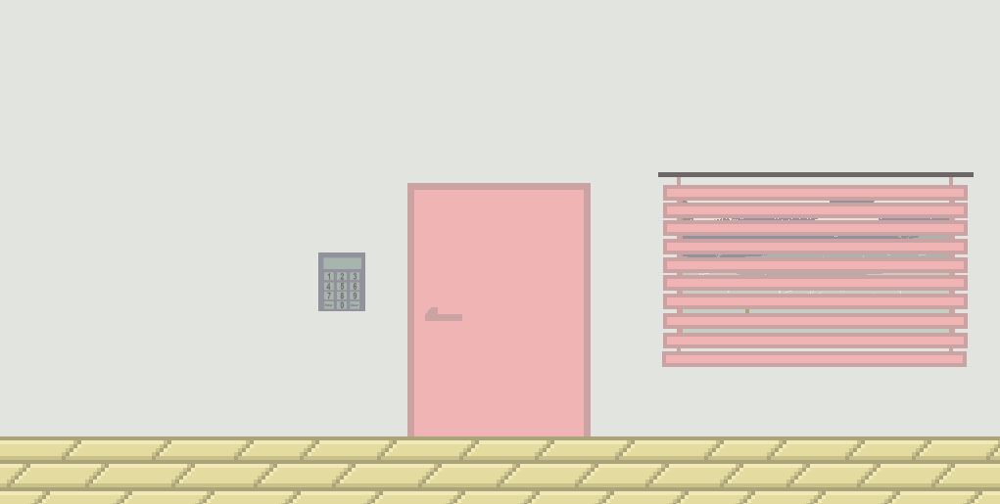

At the last one, there's the exit door, the digital lock and a window that will contain the last clue.
The code is 9564.

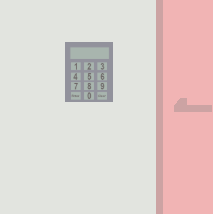  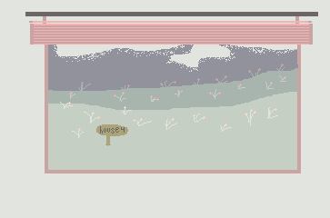

## AI use
I used for debbuging and for learn some JS concepts :D
